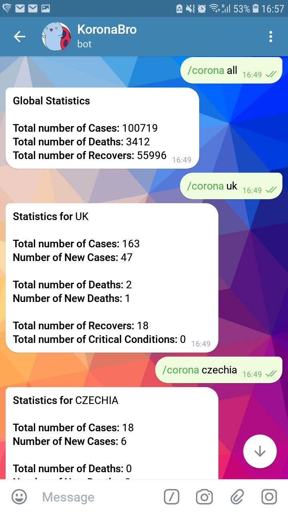
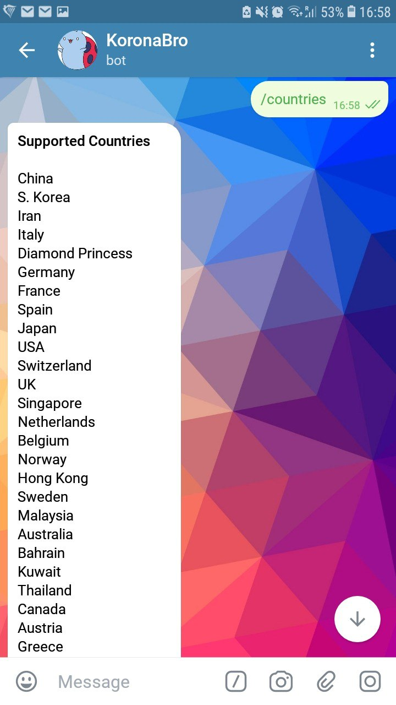

## What does this bot do?
This bot's handle on Telegram is `@koronabro_bot`. It fetches the newest statistics about the Corona Virus and sends them to you in a reply message on Telegram. All available information is a courtesy of `https://corona.lmao.ninja/`.

## Bot Commands
```bash
# get global statistics of the virus
/corona all

# get country specific statistics of the virus
/corona country_name

# get a list of all supported countries
/countries
```

## Screenshots



## License
This project is [MIT licensed](LICENSE).